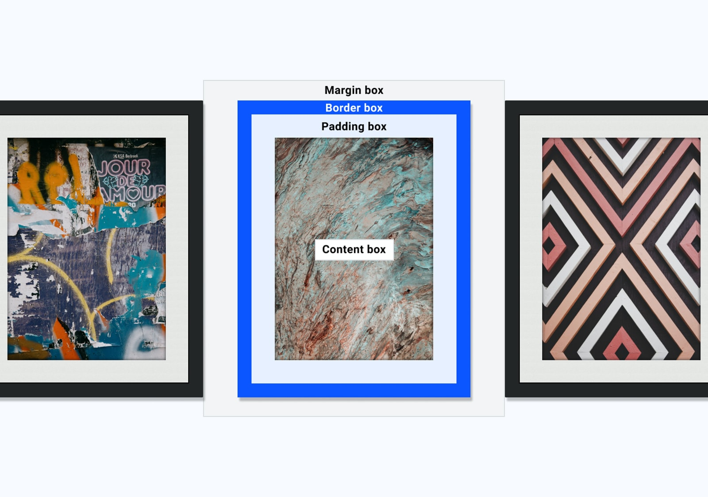

Date 11 Feb 2022
Today I study 
CSS Box model
CSS Outline
# The CSS Box Model

- a box that wraps around every HTML element.
- It consists of: `margins`, `borders`, `padding`, and the actual `content`.




###  Explanation of the different parts:

- `Content`
    - The content of the box, where text and images appear
- `Padding`
    - Clears an area around the content. The padding is transparent
- `Border`
    - A border that goes around the padding and content
- `Margin`
    - Clears an area outside the border. The margin is transparent

---

### Width and Height of an Element

- When you set the width and height properties of an element with CSS, you just set the width and height of the content area.
- To calculate the full size of an element, you must also add padding, borders and margins.

```css
div {
  width: 320px;
  padding: 10px;
  border: 5px solid gray;
  margin: 0;
}
```
The calculation of width of div element:
```
    320px (width)
    + 20px (left + right padding)
    + 10px (left + right border)
    + 0px (left + right margin)
    = 350px
```
